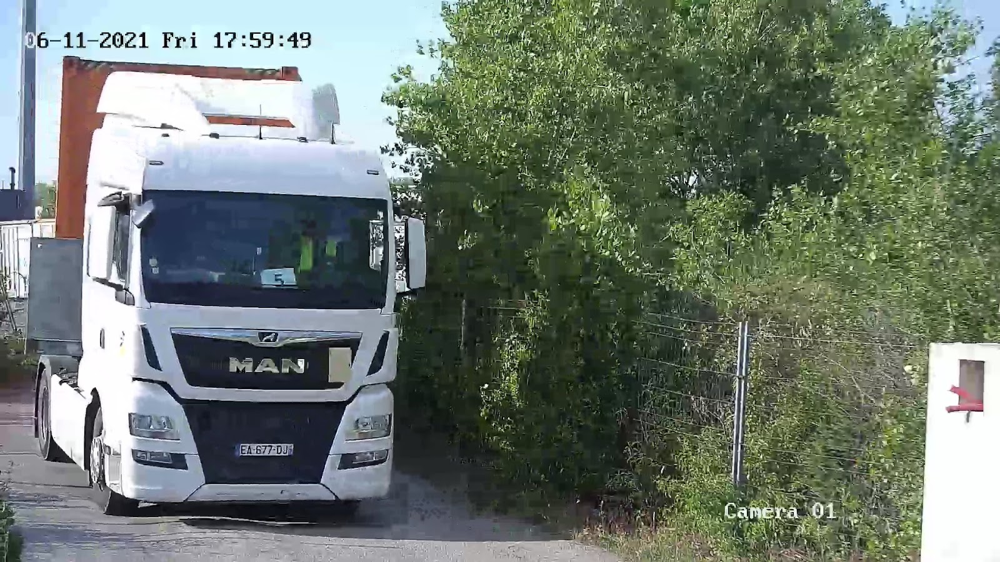
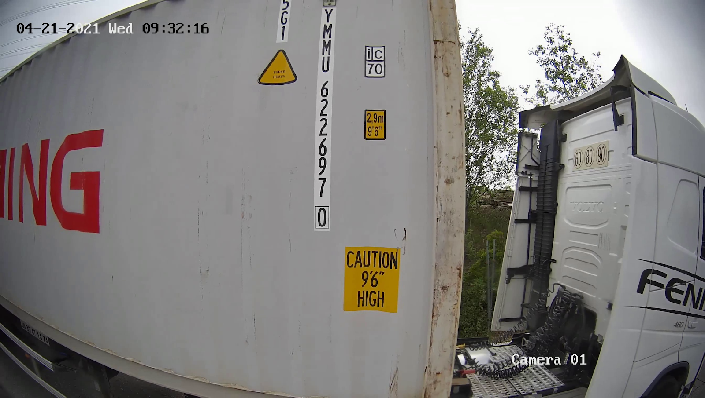

# A C++ Evaluation

## The Real Use case

A terminal wants to monitor their ins and outs from a given access point, Everytime that a vehicle passes through this point, we want to process a short video clip of the transit in order to provide in real time the relevant information such as license plate, shipping container code, etc.
Although we have to monitor this access point 24/7, most of the time there isn't a vehicle passing by, so it will be a waste of computational resources to process each and every frame.

The terminal installs two standard IP cameras, 30 fps, to monitor the access point. One with a frontal view to capture the license plates, and the other one with a  lateral view, several meters away, to see the container codes (see Fig. 1).

 Some cameras brands that we have worked with previously:

 * [Axis](https://www.axis.com/products/axis-p14-series)
 * [Avigilon](https://www.avigilon.com/products/cameras-sensors/h4a)
 * [Alhua](https://www.dahuasecurity.com/es/products/All-Products/Network-Cameras/WizSense-Series)

<table style="padding:10px">
	<tr>
	 	<td align="center"></td>   
		<td align="center"></td>
	</tr>
	<tr>
	 	<td align="center"">Cam A: Frontal view</td>   
		<td align="center">Cam B: Lateral view</td>
	</tr>
	<tr>
	 	<td colspan="2" align="center">Figure 1</td>   
	</tr>
</table>


## Simple Motion Detection Data pipeline

To begin this evaluation, a simplified typical use case will be described.

As summary, a video recording is required when motion is detected in a period of time over a camera stream.
When the motion is detected, the application will start recording video related to a camera, and stop
several seconds after no motion is detected.

The workflow would look like this:

1. Open connection with camera url (RTSP protocol).
2. Retrieve a new frame
3. Check if motion is detected on a frame.
4. Start video recording if motion is detected.
5. Stop video recording a few seconds later (this time should be configurable) after the no motion is detected.

We provide the code related to motion detection, so you can focus just in create the entire solution.
The MotionDetector class to use to detect any motion is under '''src/motion-detection''' directory. This part of code is a total mock. But provides a generic and deterministic way to test. Please feel free to change on demand.

Processing everything in a single main could be exhausting for the CPU and it could create a bottleneck.
As consequence, we will appreciate a concurrent approach.

To test your solution, we provide several convenience files:
* A docker compose to run an environment to emulate a camera based on video file.
* A s3 public file to download a required video.
* A full docker compose environment to run properly the environment.

We are working a lot with docker compose and docker framework, as recommendation, we suggest to install docker and docker-compose.

## Pre-requisites

* Install Docker CE (follow [Installation Guide](https://docs.docker.com/engine/install/ubuntu/)).
* Make sure about [post installation step for Docker](https://docs.docker.com/engine/install/linux-postinstall/).
* Install docker-compose (follow [installation guide](https://docs.docker.com/compose/install/#install-compose-on-linux-systems)).
* Download video from [s3://allread-public-technical-evaluation/train-example.mp4](s3://allread-public-technical-evaluation/train-example.mp4)


## Instructions

* Fork this git project and make it yours to start. Create a user on github and fork this repository.
* Write as much code as you consider while maintaining a homogeneous and consistent structure.
* Create an infrastructure to build and launch the project and create a simple step by step guide to perform these actions.
* We recommend to create a README file and write down anything related to the previous instruction and any other clarification as well.
* Add log traces to see the behavior of your solution.
* From the received email related to this evaluation, you have 7 days to approach and complete this test.
* For any question, do not hesitate to contact [jesus.tejedor@allread.ai](mailto:jesus.tejedor@allread.ai). If you consider that you require a longer explanation
we can set up a meeting to explain in detail this evaluation.
* When you finish, commit your work on your forked repository, do not forget add JTejedor as reader/developer role and send a confirmation to the previous email.


## Recommendations:

* We are working using Docker. Could you add a procedure to move your compiled solution to a docker container? It is not mandatory but it is a plus.
* The project should use only C++ language, but of course, you might use any library of your choice. We recommend OpenCV to start.
* Use GStreamer is a big plus.
* We are using CMake as automation tool to build.
* The use of the C++17 standard, where applicable, will be appreciated.
* Make it work, make it right, make it fast.

## Test environment

1. Download from s3 the video and write in ./video.
2. Start docker compose in docker folder
	```bash
	$ docker-compose -f ./docker/docker-compose.yml up
	```
3. You application could connect easily to our emulated camera on this rstp uri: ```rtsp://localhost:61250/cam01```
4. Keep in mind, that there is already a second camera on rstp uri: ```rtsp://localhost:61250/cam01```
3. Stop docker compose
	 ```bash
	 $ docker-compose -f ./docker/docker-compose.yml down
	 ```
